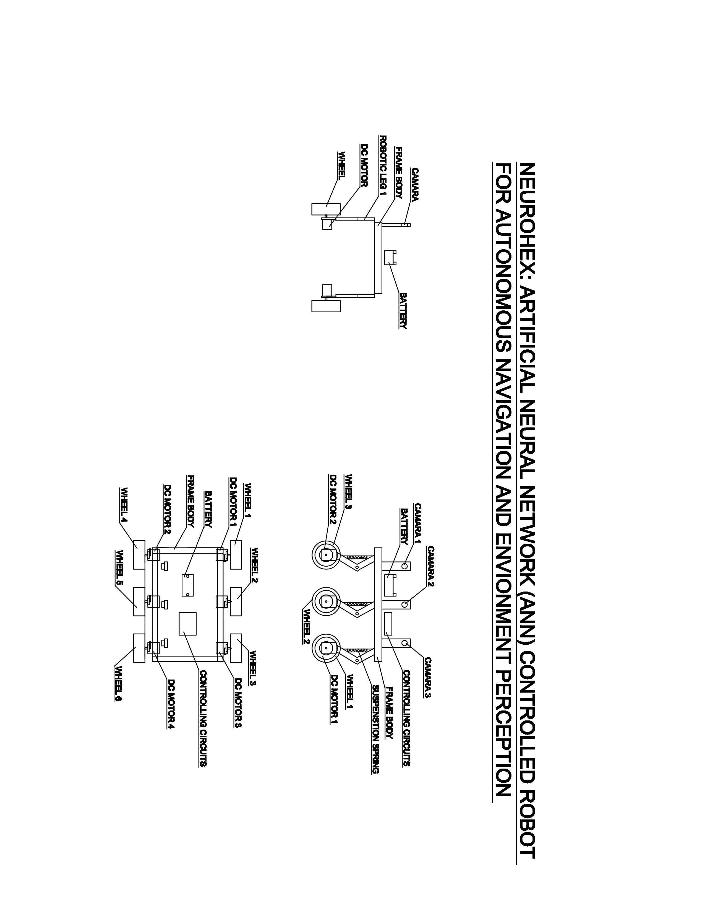

# NeuroHex-ANN-Controlled-Robot-for-Autonomous-Navigation-and-Environment-Perception

This is my Final year project in my UG from RNSIT, Bangalore. The project is based on implementing Object detection Model on a SBC Raspberry Pi 3B+ and also controlling the robot which is a 6WD Vehicle through real world. The uniqueness of this project is implementing an OBject detection model on Raspberry Pi 3B+ Board which hasn't been tried before.
This project, NeuroHex, is an autonomous robot that leverages an Artificial Neural Network (ANN) for intelligent navigation and environment perception. Designed to handle complex and uneven terrains, the robot uses a fusion of hardware and software components to perceive its surroundings, detect objects, and navigate autonomously.

## Software and Hardware Setup 
Both hardware and software requirements are equally essential for reaching the aim of the project. A good hardware is what which is going to drive the necessary tools and applications of software meet the required result metrics.

### Hardware Setup
First, we are going to setup our hardware which is foundation. The hardware setup includes both mechanical designing of project and also electronic setup. The mechanical design was done using Solidedge Software which is a Mechanical CAD. As the idea was to build a 6WD robot chassis, we created a design aligned with it. The design file was later given to a workshop where it was built by a Fabricator. It was made from Industrial grade steel. The 4 wheels front and back were powered by 10 RPM Geared DC Motor. These motors needed 12V 1.6Amp power. It was provided by a Lipo Battery 12V 1.6A.

The CAD modelling can be seen below: 

