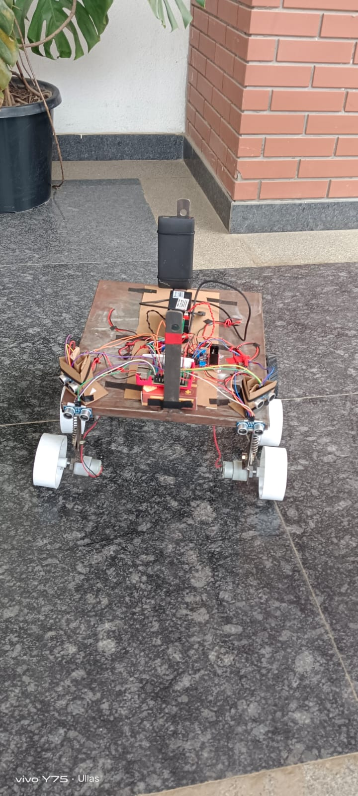

# NeuroHex-ANN-Controlled-Robot-for-Autonomous-Navigation-and-Environment-Perception

This is my Final year project in my UG from RNSIT, Bangalore. The project is based on implementing Object detection Model on a SBC Raspberry Pi 3B+ and also controlling the robot which is a 6WD Vehicle through real world. The uniqueness of this project is implementing an OBject detection model on Raspberry Pi 3B+ Board which hasn't been tried before.
This project, NeuroHex, is an autonomous robot that leverages an Artificial Neural Network (ANN) for intelligent navigation and environment perception. Designed to handle complex and uneven terrains, the robot uses a fusion of hardware and software components to perceive its surroundings, detect objects, and navigate autonomously.

## Software and Hardware Requirements 
Both hardware and software requirements are equally essential for reaching the aim of the project. A good hardware is what which is going to drive the necessary tools and applications of software meet the required result metrics.

### Hardware Setup
First, we are going to setup our hardware which is foundation. The hardware setup includes both mechanical designing of project and also electronic setup. The mechanical design was done using Solidedge Software which is a Mechanical CAD. As the idea was to build a 6WD robot chassis, we created a design aligned with it. The design file was later given to a workshop where it was built by a Fabricator. It was made from Industrial grade steel. The 4 wheels front and back were powered by 10 RPM Geared DC Motor. These motors needed 12V 1.6Amp power. It was provided by a Lipo Battery 12V 1.6A.

The CAD modelling can be seen below: 

  
  

<b>CAD Modelling of the Robot Chassis and Dimensions of the Components</b>

Once the Robot chassis is fabricated, I and my team have made the necessary connections as shown in the image below : 

<b>Circuit Connect on Robot Chassis</b>

We have used the following components :

1. Raspberry Pi 3B+ and a 16GB MicroSD card as OS for the same.

2. 4 Ultrasonic Sensors -> 2 each at 2 corners (facing forward and facing diagonal)
     
3. 4 10 ROM DC Geared Motors
    
4. 2 2WD DC Motor Drivers L298N
     
5. Raspberry Pi Camera Module 3
   
6. Power source for Pi (Phone Power bank)
     
7. Wires and Data/Power Cable
     
8. LIPO Battery 1.3A 12V (comes along with a charger)

   Once the connection of above components are done. The hardware setup is done and lets move to the software setup. The images of the same can be viewed below:

<b>Front and Top View Connection of Circuit as per Circuit connection image(Note: A peakhole has been made for the camera lens)</b>

### Software Setup and Actual Working in Realtime
1. Raspberry Pi's OS :
   The OS used for the entire project was 32Bit OS Debian Bookworm with Desktop. The OS is loaded in the SD card which was a 16GB Samsung MicroSD card. It was first formatted using [SD Card Formatter](https://www.sdcard.org/downloads/formatter/) You can dowanload the software based on your OS used in PC.

<b>SD card formatted </b>

                 

Once formating the SD card is done, the MicroSD card is loaded with ISO image. It can be done easily using [Raspberry Pi Imager](https://www.raspberrypi.com/software/) and choosing the required OS. The ISO image will be loaded onto MicroSD card and then it is inserted into the Pi Board.

<b>Raspberry Pi Imager UI </b>

 

There is nothing as Boot loader as the Pi's ROM is directly loaded an OS. Connect the Pi board to the peripherals such as *Desktop , Mouse and Keyboard* Now you can confiure the raspberry pi. Give a custom **Username** and **Password**. Configure WLAN (WIFI) with a known network so that it connects automatically when booted ON. This is very essential as this the way we will be going to work in further stages by enabling SSH. In services enable **SSH** and **VNC**. Once it gets connected to the wifi you can unplug the peripherals and can use remotely using any Third Party Softwares -> CLI(Putty, Remote Resktop Connection by Microsoft, bash/Powershell/Command Prompt) or GUI Desktop (RealVNC, VNC Server or anyother softwares). 

<b>Configuring The Pi </b>

  

    
2. Installing packages and Pre-trainned DNN Model:
   
Once configuring the Pi is done and you have connected through RealVNC **ssh pi@<IP_ADDRESS>**
, you can download the packages required for the project:

    sudo apt update && sudo apt upgrade 
    pip3 install flask
    pip3 install opencv-python
    pip3 install opencv-python-headless   # sometimes needed for headless Pi
    pip3 install numpy
    pip3 install pillow

*First we tried to run yolov5n model on Raspberrpi3B+ but it didn't run as it's not feasible to run a high model on low computational power device.*

Later we shitched to more optimized model for proper working of **Object detection** on Pi.
Install the interpreter tool which is Tensorflow Lite version of actual TensorFlow, but as TF whole library can't run on Pi board we use the lite version.

    pip3 install tflite-runtime

Install the camera library for operating with Pi Camera Module :

    sudo apt install -y python3-picamera2

You can check the camera functionality by sourcing this line in terminal :

    libcamera-still -o test_image.jpg

Once the hardware functioning is great and all software requirement is met, you can deploy a Model on Pi to detect object. So in this project we have used SSD MobileNet Version 2:

    wget https://github.com/PINTO0309/TensorflowLite-bin/raw/main/models/mobilenet_ssd_v2_coco_quant_postprocess.tflite -O /home/pi/object_detection/detect.tflite #Copying the model file onto your local PC.

    wget https://raw.githubusercontent.com/tensorflow/models/master/research/object_detection/data/mscoco_label_map.pbtxt -O /home/pi/object_detection/labelmap.txt # 1 line Label text.

Verify that you have downloadeded the model file and object list.

    ls /home/pi/object_detection/

3. Programming the object detection code and it's working :
   
Once done with downloading the softwares, my team have coded a program for Object Detection. It can be accessed from [object_detection_code.py](Code/object_detection_code.py)
    
So in this code we have created a Webapp instance using *Flask*, and the output can be seen in :
    
    http://<your-pi-ip>:5000/video_feed
    #http://192.168.1.42:5000/video_feed , run cmd : hostname -I to get IP addr

The video data is configured by Picamera2 library to required colour format and resolution, the variable name is also "camera" in the code. 
The model and labelmap files are loaded into the code and given to the tflite-runtime interpreter. The video image frames are taken as input and boxes are drawn around objects and the labels are alloted with the confidence level from 0 to 1.

The output feed can be accessed if you are in the common shared network by the web interface :

    http://192.168.1.42:5000/video_feed

You can stop the program by killing the process **Ctrl + C** or **Ctrl + Z**.
The output generated can be seen below:

  
  

<b>Object Detection in Real Time</b>

4. Navigation :
   
 The navigation of the robot is also done using a Python3 library *IntraSOm*.

    sudo apt-get update && sudo apt-get upgrade -y
    sudo apt-get install python3-rpi.gpio -y
    pip3 install numpy minisom

The code for the navigation can be accessed : [Navigation code](Code/Navigation with SOM and HRSC04 ultrasonic sensors.py).

The program based on the hardware connections done in the [Circuit Diagram](Images/Circuit_Connection_Image_page-0001.jpg) showing 4 HCSR04 Sensors, 2 2WD Motor Drivers connected to the GPIO's of PI Board. Based on the sensor data the Python Library -> IntraSOM creates a Mapping for the robot such that it can traverse in that environment.

    

